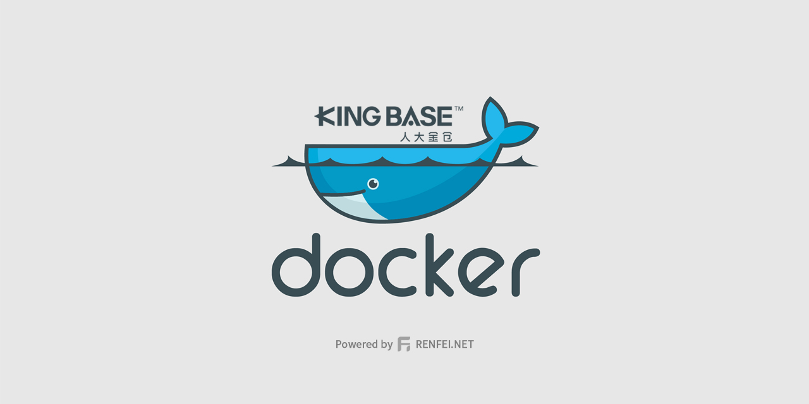
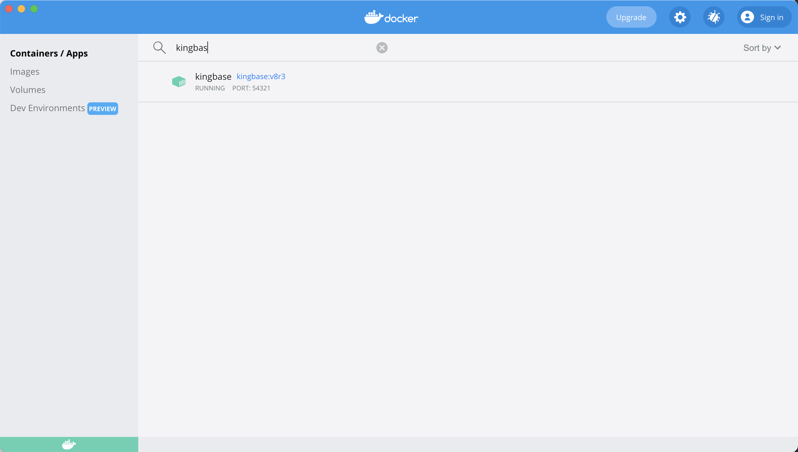
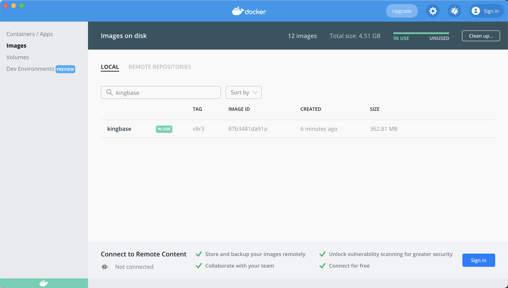

# 人大金仓数据库管理系统（KingbaseES V8 R3) Docker 镜像

本人使用 MacOS 开发项目，无法安装人大金仓数据库，所以将人大金仓数据库封装到了 Docker，分享出来给各位程序员使用。

使用的人大金仓版本号：V008R003C002B0320

教程文章：[在苹果 MacOS 上基于 Docker 容器运行人大金仓（Kingbase）V8 R3 数据库的教程](https://www.renfei.net/posts/1003506)

## 拉取镜像

很多同学不太会构建镜像，或者懒得构建镜像，我已经将我的镜像上传至各个仓库：

### Github

[https://github.com/renfei/kingbase-es-v8-r3-docker/pkgs/container/kingbase](https://github.com/renfei/kingbase-es-v8-r3-docker/pkgs/container/kingbase)

```bash
docker pull ghcr.io/renfei/kingbase:v8r3
```

### 极狐 GitLab

[https://jihulab.com/renfei/kingbase-es-v8-r3-docker/container_registry/218](https://jihulab.com/renfei/kingbase-es-v8-r3-docker/container_registry/218)

```bash
docker pull registry.jihulab.com/renfei/kingbase-es-v8-r3-docker:v8r3
```

### GitLab

[https://gitlab.com/renfei/kingbase-es-v8-r3-docker/container_registry/2430544](https://gitlab.com/renfei/kingbase-es-v8-r3-docker/container_registry/2430544)

```bash
docker pull registry.gitlab.com/renfei/kingbase-es-v8-r3-docker:v8r3
```

## 构建镜像

如果您想自己构建镜像可参照以下操作：

```bash
git clone https://github.com/renfei/kingbase-es-v8-r3-docker.git
cd kingbase-es-v8-r3-docker
docker build -t kingbase:v8r3 .
```

注意 ```docker build -t kingbase:v8r3 .``` ，后面有个点（.）不能缺。

国内用户可将 ```https://github.com/renfei/kingbase-es-v8-r3-docker.git``` 更换为码云地址 ```https://gitee.com/rnf/kingbase-es-v8-r3-docker.git```

## 运行

```bash
docker run -d --name kingbase -p 54321:54321 -e SYSTEM_PWD=SYSTEM -v /opt/kingbase/data:/opt/kingbase/data -v /opt/kingbase/license.dat:/opt/kingbase/Server/bin/license.dat kingbase:v8r3
```

- --name: 容器名称
- -p: 端口映射
- -e: 默认用户SYSTEM,通过环境变量SYSTEM_PWD指定初始化数据库时的默认用户密码
- -v: 挂载宿主机的一个目录，这里挂载了数据目录和license文件

## 截图





## 常见问题
### 启动失败
- 启动失败，日志报 kingbase: superuser_reserved_connections must be less than max_connections
- 原因：本仓库中的 license.dat 文件是开发测试版，限制最大连接数为10，而人大金仓配置文件默认连接数为100，导致启动失败。
- 解决：修改数据目录下的 kingbase.conf 配置文件

 ```bash
 max_connect = 10
 superuser_reserved_connections = 5 #小于max_connect
 super_manager_reserved_connections = 3  #小于superuser_reserved_connections
 ```
### FATAL: lock file kingbase.pid already exists
- 提示：FATAL: lock file kingbase.pid already exists。是因为 docker 容器被关闭了数据库还没来得及停机，我们去数据目录下把 kingbase.pid 文件删除掉即可，数据目录就是上面映射本机目录的，我的教程里是在 /opt/kingbase/data/。
